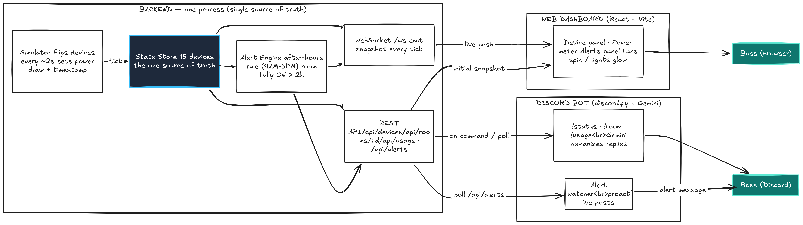

# System Architecture & Diagram

The high-level architecture of the Office Energy Monitor (Deliverable #1).



> Files in this folder:
> - `diagram.png` — the diagram above (submission image)
> - `system-diagram.svg` — a clean, editable vector version of the same diagram
> - `system-diagram.mmd` — the draft source used to lay it out
>
> Note: if you re-export `diagram.png`, two labels currently show a literal
> `<br>` — replace those with real line breaks (or export from
> `system-diagram.svg`, which renders correctly).

## The core idea

There is exactly **one source of truth** for device state — the backend's State
Store. A simulator is the only thing that mutates it. Both the web dashboard and
the Discord bot read from that same backend, so the two interfaces can never
show different data.

```
[Simulator] -> [State Store] -> [Alert Engine] -> [API Layer]
                                                      |
                                    +-----------------+-----------------+
                                    v                                   v
                            [ Web Dashboard ]                    [ Discord Bot ]
                                    v                                   v
                              Boss (browser)                     Boss (Discord)
```

## Components

| Component | Responsibility |
|---|---|
| **Simulator** | Every ~2s, flips a few devices on/off (biased by a fast "office clock"), sets each device's power draw and `lastChanged` timestamp. The only writer of state. |
| **State Store** | In-memory single source of truth holding all 15 devices, plus derived totals and the current alert list. |
| **Alert Engine** | Re-evaluates rules on every tick: devices left on **after office hours (9AM–5PM)** and any **room fully ON for > 2h**. Emits timestamped alerts. |
| **API Layer** | Exposes the store over **REST** (snapshots) and **WebSocket** (`/ws`, live push on every tick). |
| **Web Dashboard** | React + Vite + Tailwind. Loads an initial REST snapshot, then live-updates over WebSocket with no refresh. Fans spin and lights glow. |
| **Discord Bot** | discord.py + Gemini. Reads the same API, answers `!status` / `!room` / `!usage`, and proactively posts alerts. |

## Data flow (one device change → both surfaces)

1. A simulator tick flips a device (e.g. `work2-fan-1` → ON), stamps
   `lastChanged`, and recomputes `powerW`.
2. It writes into the **State Store** — the only mutable state in the system.
3. The **Alert Engine** re-evaluates its rules against the new snapshot.
4. The backend **broadcasts** the new snapshot over WebSocket → every dashboard
   updates instantly, no page refresh.
5. When the boss runs `!status` in Discord, the bot reads the **same** REST API
   and gets the identical snapshot — the bot can never contradict the dashboard.
6. If an alert fires, the bot's watcher posts it proactively to a channel.

## API surface

| Method | Path | Purpose |
|---|---|---|
| GET | `/api/devices` | Full snapshot: devices, totals, alerts, times |
| GET | `/api/rooms/{room_id}` | One room (`drawing`, `work1`, `work2`) |
| GET | `/api/usage` | Totals: current watts + estimated kWh today |
| GET | `/api/alerts` | Current alerts |
| WS  | `/ws` | Live snapshot stream (`{ "type": "snapshot", "data": {...} }`) |

## Editing / re-exporting the diagram

- Open `system-diagram.svg` directly in a browser to view or print.
- To tweak: edit the SVG (plain XML) or import it into **Figma / Excalidraw /
  draw.io**, then export a PNG if a PNG is preferred for submission.
